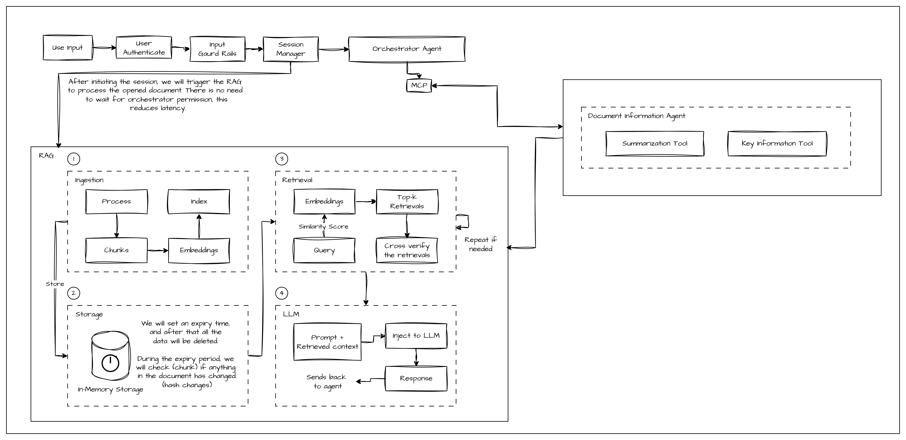

# Accorder AI

# Contract Review Application

This application leverages AI to assist users in reviewing contracts efficiently and effectively. It provides features such as contract analysis, clause identification, risk identification, summary generation, key information extraction.

## Features
1. Document Information Agent  
    1.1 Summarization  
    1.2 Key Information Extraction

## Architecture Overview

## Design Principles to follow for development
1. A function name must fully describe its intent, scope, and effect.
2. One function should perform exactly one action.
3. All inputs and outputs must be explicit and typed.
4. Each file should represent one conceptual unit.
5. Classes own state. Functions transform data.
6. Logs must explain why decisions were made, not just what happened.
7. Every error must answer: Where did it fail? Why did it fail? What action is possible to correct it?
8. If a function mutates(changes state outside) it should explicitly mention that in the name.
9. No utility modules.
10. The system should always produce the same output for the same input. 
11. Every component must be developed in a way that it can be replaced without extensive changes in other modules. 
12. Prompts should not be strings. They should be explicitly defined and versioned accordingly (mustache files).
13. No Anonymous Exceptions or Errors. Every exception/error raised must be predefined.

## File Structure
1. `schemas/` - Contains all the schema related files (input and output schemas)   
    1. `registry.py` - Contains and schemas for parsing results (input and output).   

2. `services/` - Contains all the services for the backend RAG.  
    1. `registry/` - Registry service for the parsers (we will store all the parsers here (DOCX, PDF, etc.)). 
        1. `base_parser.py` - All the parsers implemented should inherit from the `base_parser.BaseParser`   
        2. `doc_parser.py` - DOCX parser  
        3. `registry.py` - Common place for all the parsers will be maintaining a dict of parsers here. As of now only the DOCX parser.  

    2. `ingestion/` - Contains the ingestion service
        1. `ingestion.py` - Holds the main class for ingestion component and functions.

3. `api/` - All the endpoints regarding the orchestrator and other service we will make only the orchestrator api's public everything else for the debugging.
    1. `endpoints/` - Contains the folders with service endpoints like ingestion, retreival, llm and more
        1. `ingestion/` - Ingestion endpoints
            1. `router.py` - FastAPI router for Ingestion Agent.
        
        `main.py` - Main API's handler. 